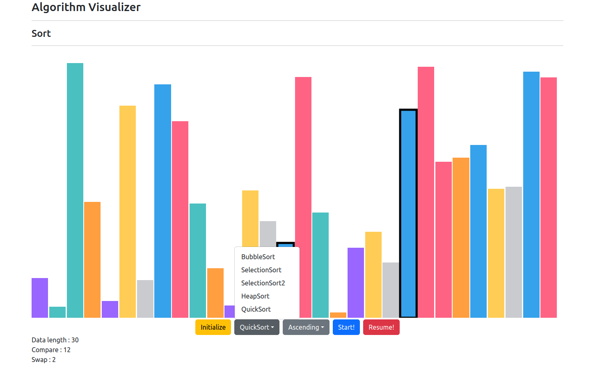

# Algorhithm Visualizer

## 1. 개요

알고리즘을 가시화 하여 설명하기 쉽도록 해준다.

## 2. 종류

### 2.1. 정렬 알고리즘

지원하는 알고리즘은 아래와 같다.

- Bubble Sort

- Selection Sort

- Selection Sort2 (two-way selection sort)

- Heap Sort

- Quick Sort